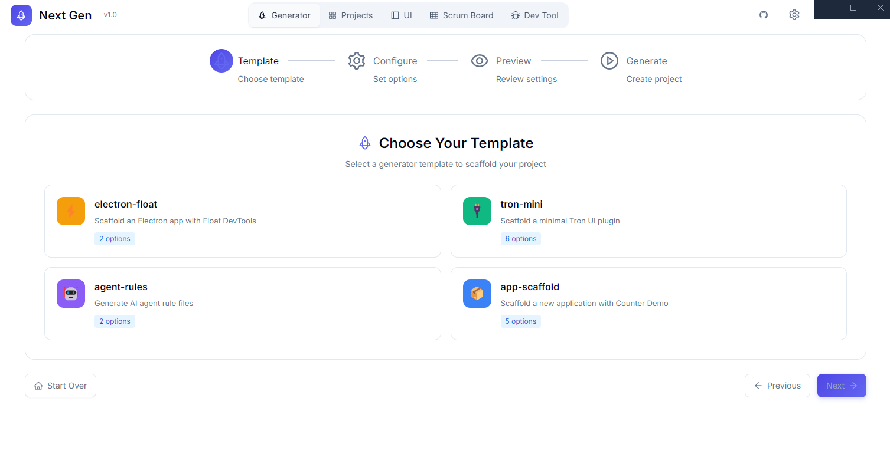
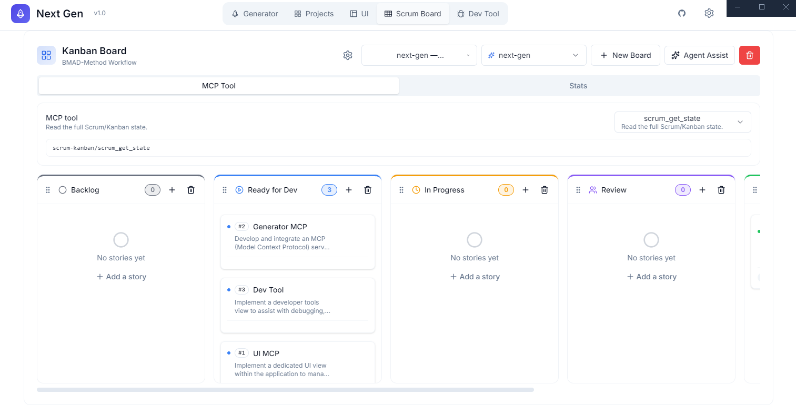

# Next Gen

the next generation of template




## Roadmap

- [ ] Add launchpad Raycast or apple spotlight style
- [ ] OCR capture
- [ ] Plugin like Raycast
- [ ] Browser device responsive + mockup device frame
- [ ] Browser extension, Proxy, ads block etc
- [ ] well Agent flow for all flow
- [ ] projects mgt with @nut-tree/nut-js for user logic many accounts or other tasks
- [ ] install MCP to target project
- [ ] Chat llm \_ Chat MCP
- [ ] Add more generators
- [ ] Add more templates
- [ ] Add more documentation
- [ ] Wallpapers
- [ ] setting manage menu and hide/show
- [ ] Release VirusTotal scan results for security verification.
- [ ] Auto update
- [ ] Https for mcp

The issue is that Turborepo expects a specific structure. Here's the correct setup:

## Path dir

npm run gen
default for turbo repo apps/

. for root
custom test/

## Correct Structure for External Generators

```bash
turbo-generators/
├── package.json
├── turbo/
│   └── generators/
│       ├── config.ts       # Main config file
│       └── templates/
│           ├── component.hbs
│           └── package.hbs
```

**The key is:** Generators must be inside `turbo/generators/` directory!

## Step-by-Step Fix

### 1. **Restructure your repo:**

```bash
cd turbo-generators
mkdir -p turbo/generators
mv config.ts turbo/generators/
mv templates turbo/generators/
```

### 2. **Update package.json:**

```json
{
  "name": "turbo-generators",
  "version": "1.0.0",
  "type": "module",
  "dependencies": {
    "@turbo/gen": "^2.6.3"
  },
  "exports": {
    ".": "./turbo/generators/config.ts"
  }
}
```

### 3. **Fix config.ts path references:**

```typescript
// turbo/generators/config.ts
import type { PlopTypes } from "@turbo/gen";

export default function generator(plop: PlopTypes.NodePlopAPI): void {
  plop.setGenerator("component", {
    description: "Create a new component",
    prompts: [
      {
        type: "input",
        name: "name",
        message: "Component name?",
      },
    ],
    actions: [
      {
        type: "add",
        path: "src/components/{{pascalCase name}}.tsx",
        templateFile: "templates/component.hbs", // Relative to config.ts
      },
    ],
  });
}
```

### 4. **Reference in your monorepo's turbo.json:**

```json
{
  "$schema": "https://turbo.build/schema.json",
  "generators": {
    "source": "git+https://github.com/your-org/turbo-generators.git"
  }
}
```

### 5. **For local development (before pushing to git):**

```json
{
  "generators": {
    "source": "../turbo-generators"
  }
}
```

Or install it locally:

```bash
# In your monorepo
npm install ../turbo-generators --save-dev
```

Then:

```json
{
  "generators": {
    "source": "node_modules/turbo-generators"
  }
}
```

### 6. **Test it:**

```bash
cd your-monorepo
turbo gen
```

You should now see your generators listed!

## Quick Development Workflow

**Option A - Local Path:**

```json
// turbo.json in your monorepo
{
  "generators": {
    "source": "../turbo-generators"
  }
}
```

**Option B - npm link:**

```bash
cd turbo-generators
npm link

cd ../your-monorepo
npm link turbo-generators
```

## Useful links

<https://github.com/olliethedev/ui-builder>
<https://github.com/AndyMik90/Auto-Claude/>
<https://github.com/ShareX/ShareX>
