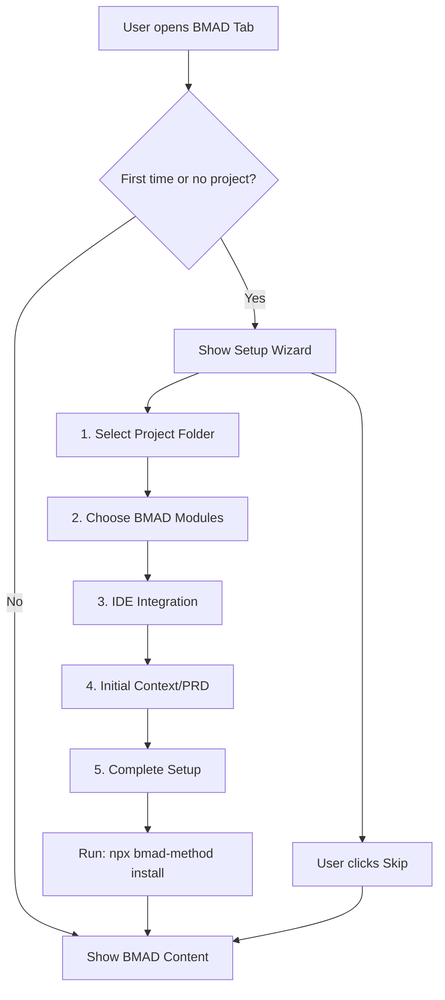
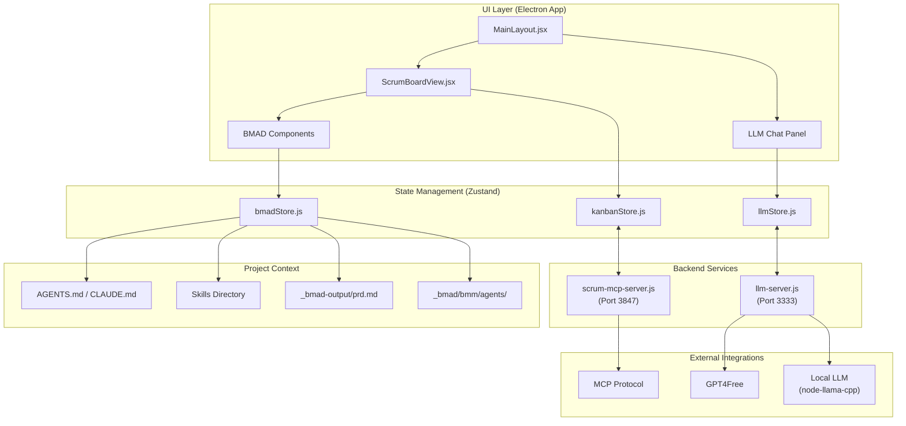
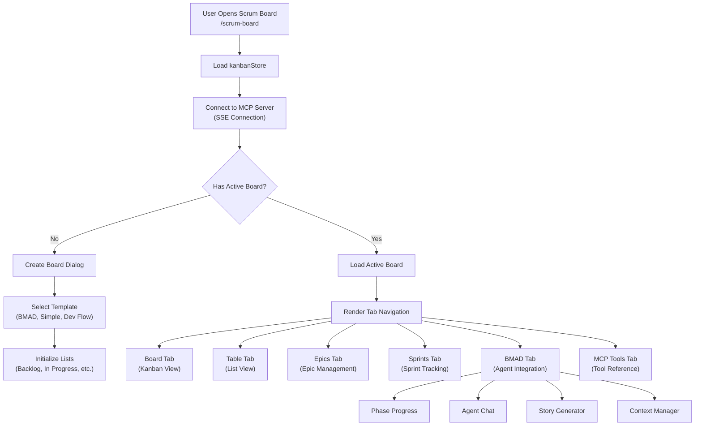
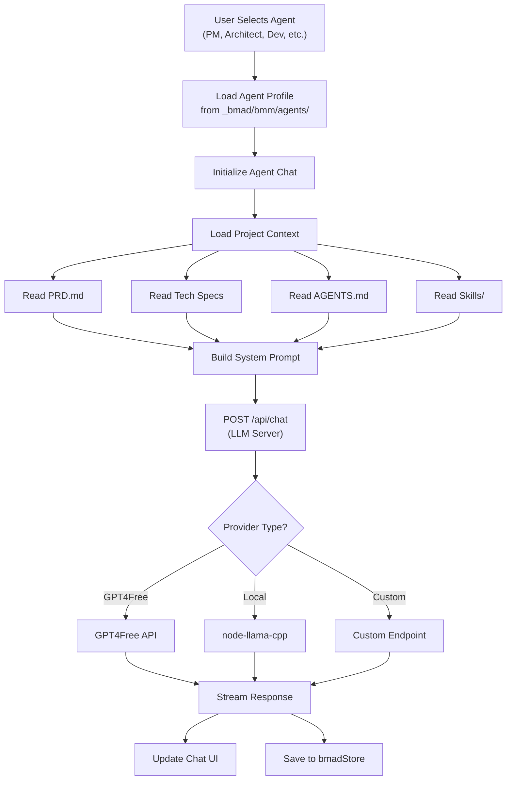
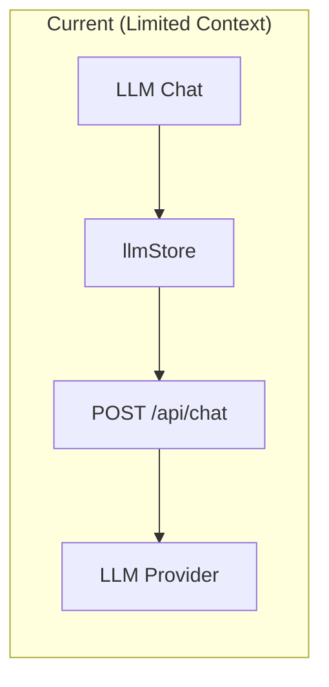
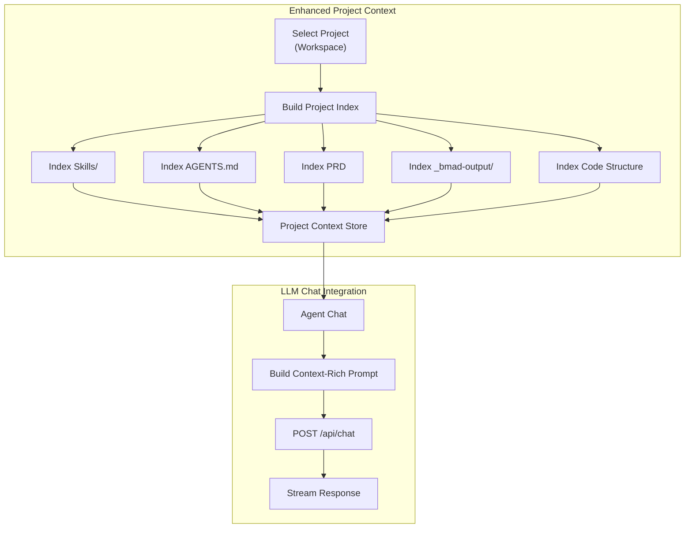
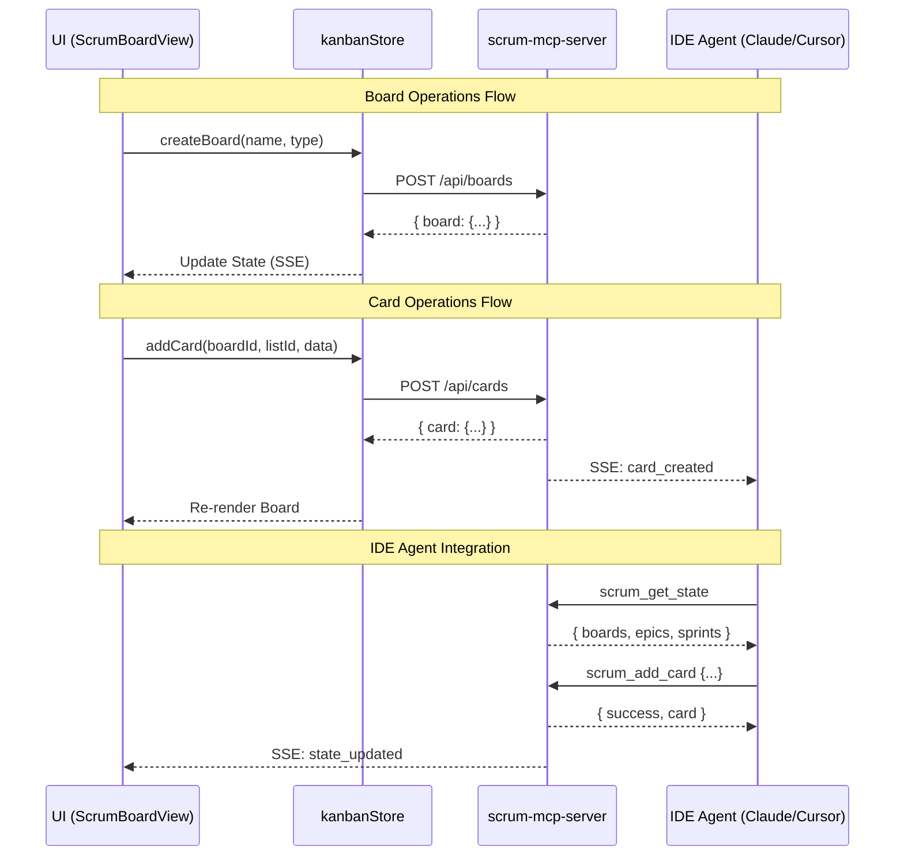
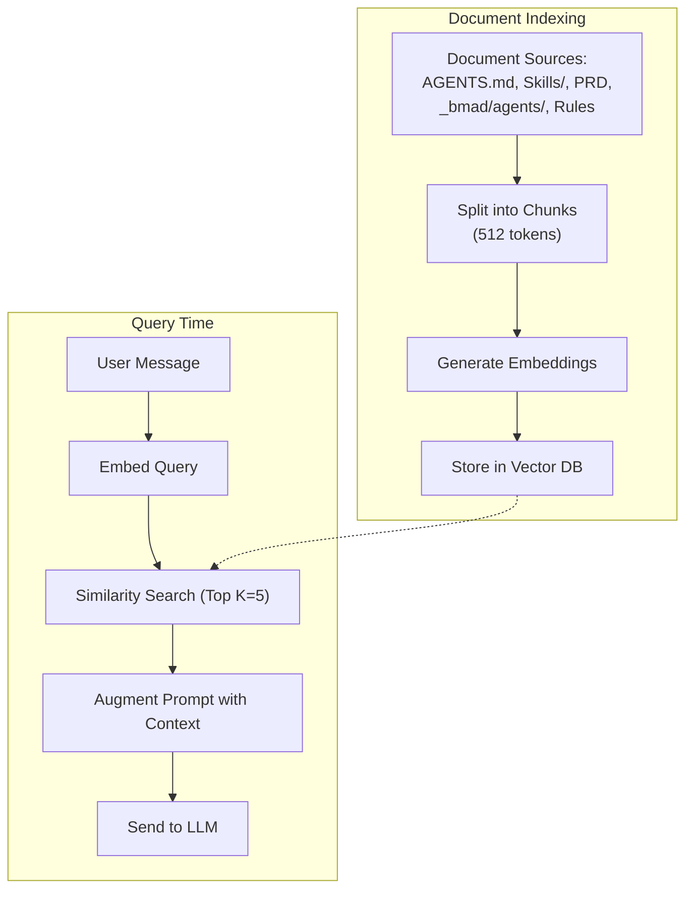
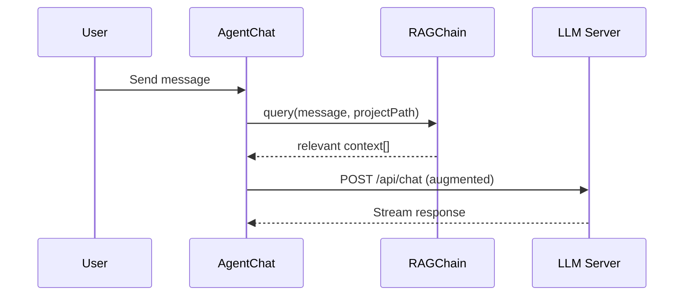

# Scrum Feature Improvement v1.0.1

---

## 📋 BMAD v6 Setup

### Overview

BMAD-METHOD™ v6 (Breakthrough Method for Agile AI-Driven Development) requires proper setup before using the Agent Chat feature.

### Installation Methods

#### Method 1: CLI Setup (Recommended for new projects)

```bash
# Install BMAD v6 via npx
npx bmad-method@alpha install

# The wizard will prompt for:
# 1. Installation directory (. for current folder)
# 2. Module selection (Core, UX, Testing, Docs, Solo Dev)
# 3. Document sharding options (PRD, Architecture)
# 4. IDE configuration (Cursor, VS Code, Claude Code, Windsurf)
```

#### Method 2: GUI Setup Wizard (In-App)

1. Open **Scrum Board** → **BMAD** tab
2. On first use, the **Setup Wizard** will appear automatically
3. Follow the steps:
   - **Select Project**: Choose your project folder
   - **Choose Modules**: Select BMAD modules to install
   - **IDE Integration**: Configure your development environment
   - **Initial Context**: Import existing PRD or start fresh
4. Click **Complete Setup** or **Skip** to continue without setup

### Required Files After Setup

| File            | Location                | Purpose                              |
| --------------- | ----------------------- | ------------------------------------ |
| **BMAD Agents** | `_bmad/bmm/agents/*.md` | Agent personas (PM, Architect, etc.) |
| **BMAD Config** | `_bmad/bmm/config.yaml` | Project config (user name, language) |
| **PRD**         | `_bmad-output/prd.md`   | Product Requirements Document        |

### Configuration Files Created

```text
project-root/
├── _bmad/
│   ├── bmm/
│   │   ├── agents/           # Agent persona files
│   │   │   ├── pm.md
│   │   │   ├── analyst.md
│   │   │   ├── architect.md
│   │   │   ├── sm.md
│   │   │   └── dev.md
│   │   ├── config.yaml       # User configuration
│   │   └── workflows/        # Workflow definitions
│   └── core/                 # Core templates
├── _bmad-output/             # Generated artifacts
│   ├── prd.md
│   └── architecture.md
└── .cursorrules / .windsurfrules  # IDE-specific rules
```

### GUI Setup Wizard Flow



### Troubleshooting

If Agent Chat doesn't load context, check:

```bash
# Verify BMAD installation
ls _bmad/bmm/agents/  # Should show pm.md, analyst.md, etc.

# Check config exists
cat _bmad/bmm/config.yaml  # Should show project_name, user_name

# Re-run installation if needed
npx bmad-method@alpha install
```

---

## Deep Flow Diagram

### System Architecture Overview



---

## Component Deep Dive

### 1. Scrum Board View Flow



### 2. BMAD Agent Integration Flow



### 3. Project-Scoped LLM Chat Flow (Current vs Proposed)

#### Current Implementation



#### Proposed Enhancement



### 4. MCP Server Integration Flow



---

## Current Code Structure

### Files Analysis

| File                  | Lines  | Size  | Purpose                                        |
| --------------------- | ------ | ----- | ---------------------------------------------- |
| `ScrumBoardView.jsx`  | 7,891  | 295KB | Main scrum board component (needs refactoring) |
| `kanbanStore.js`      | 1,429  | 41KB  | Zustand store for board state                  |
| `bmadStore.js`        | 615    | 19KB  | BMAD phase/context management                  |
| `scrum-mcp-server.js` | ~3,000 | 106KB | MCP server with all scrum tools                |
| `AgentChat.jsx`       | ~400   | 15KB  | Agent-specific chat component                  |
| `StoryGenerator.jsx`  | ~500   | 21KB  | Story generation from PRD                      |

### BMAD Agents (from `_bmad/bmm/agents/`)

| Agent         | File                     | Phase          | Purpose                 |
| ------------- | ------------------------ | -------------- | ----------------------- |
| Analyst       | `analyst.md`             | Analysis       | Research, product brief |
| PM            | `pm.md`                  | Planning       | PRD, requirements       |
| UX Designer   | `ux-designer.md`         | Planning       | UX/UI design            |
| Architect     | `architect.md`           | Solutioning    | Architecture design     |
| Scrum Master  | `sm.md`                  | Implementation | Sprint management       |
| Developer     | `dev.md`                 | Implementation | Code implementation     |
| Tech Writer   | `tech-writer.md`         | Implementation | Documentation           |
| Test Engineer | `tea.md`                 | Implementation | Testing/QA              |
| Quick Flow    | `quick-flow-solo-dev.md` | All            | Solo dev workflow       |

---

## Improvement Recommendations

### 1. Code Restructuring

**Problem**: `ScrumBoardView.jsx` is 7,891 lines - too large and hard to maintain.

**Solution**: Extract into smaller components:

```text
views/ScrumBoardView/
├── index.jsx                    # Main entry (routing)
├── ScrumBoardView.jsx          # Main layout (reduced)
├── components/
│   ├── BoardView/              # Kanban board view
│   │   ├── index.jsx
│   │   ├── BoardColumn.jsx
│   │   └── DragDropContext.jsx
│   ├── TableView/              # Table/list view
│   ├── EpicsView/              # Epic management
│   ├── SprintsView/            # Sprint tracking
│   ├── BmadPanel/              # BMAD integration panel
│   │   ├── index.jsx
│   │   ├── PhaseSelector.jsx
│   │   └── WorkflowRunner.jsx
│   └── McpToolsPanel/          # MCP tools reference
├── hooks/
│   ├── useBoard.js
│   ├── useSprints.js
│   └── useAgentContext.js
└── constants/
    └── index.js
```

### 2. Project-Scoped LLM Context

**Current**: LLM chat has no project context awareness.

**Proposed Enhancement**:

```javascript
// New: projectContextStore.js
const useProjectContextStore = create((set, get) => ({
  activeProject: null,
  projectIndex: {
    skills: [],        // Skills/*.md files
    agentRules: null,  // AGENTS.md content
    prd: null,         // PRD document
    architecture: null, // Architecture docs
    codeStructure: [], // File tree summary
  },

  setActiveProject: async (projectPath) => {
    // Index project files
    const skills = await indexSkills(projectPath);
    const agentRules = await readAgentRules(projectPath);
    const prd = await readPRD(projectPath);

    set({ activeProject: projectPath, projectIndex: { skills, agentRules, prd, ... } });
  },

  buildContextPrompt: () => {
    const { projectIndex } = get();
    return `
## Project Context
- Skills: ${projectIndex.skills.map(s => s.name).join(', ')}
- Agent Rules: ${projectIndex.agentRules?.substring(0, 1000)}
- PRD Summary: ${projectIndex.prd?.substring(0, 2000)}
    `;
  }
}));
```

### 3. Menu/Route Cleanup

**Current Navigation** (from MainLayout.jsx):

- `/launchpad` - Search/actions hub
- `/generator` - Generator view
- `/projects` - Projects view
- `/resources` - Resources view
- `/ui` - UI Builder
- `/scrum-board` - Scrum Board ✅
- `/browser` - Browser view
- `/tests` - Test management
- `/settings` - Settings

**Proposed Cleanup**:

- Keep `/scrum-board` as main scrum route
- Remove redundant BMAD dashboard if exists
- Consolidate agent chat into scrum board

---

## 🧠 Long-Term Memory / RAG Architecture (FUTURE - v1.0.2)

> **Note**: This feature is planned for the next iteration. Current focus is on project context store and code cleanup.

### Technology Stack

| Component     | Technology                                        | Purpose                 |
| ------------- | ------------------------------------------------- | ----------------------- |
| Vector Store  | **MemoryVectorStore** (dev) / **ChromaDB** (prod) | Store embeddings        |
| Embeddings    | **transformers.js** or **OpenAI**                 | Convert text to vectors |
| Text Splitter | **RecursiveCharacterTextSplitter**                | Chunk documents         |
| Orchestration | **LangChain.js**                                  | RAG pipeline            |

### RAG Flow Architecture



### New Files Structure

```text
packages/llm/src/memory/
├── conversation.ts     # (existing)
├── storage.ts          # (existing)
├── vectorStore.ts      # NEW - Vector store wrapper
├── indexer.ts          # NEW - Document indexing
├── rag.ts              # NEW - RAG chain
└── embeddings.ts       # NEW - Embedding provider

apps/ui/src/renderer/src/stores/
├── projectContextStore.js  # NEW - Project context
```

### Agent Chat Integration



### Vector Store Options

| Option                | Best For                     |
| --------------------- | ---------------------------- |
| **MemoryVectorStore** | Development (fast, no setup) |
| **ChromaDB**          | Production (persistent)      |
| **SQLite-VSS**        | Desktop apps (portable)      |

---

## Next Steps

1. **Review this flow diagram** in `docs/improvement1.0.1.md`
2. **Phase 1**: Implement RAG memory system (indexer + vector store)
3. **Phase 2**: Create projectContextStore for project-scoped context
4. **Phase 3**: Integrate RAG with AgentChat
5. **Phase 4**: (Optional) Refactor ScrumBoardView.jsx
6. **Phase 5**: Clean up routes/menus
